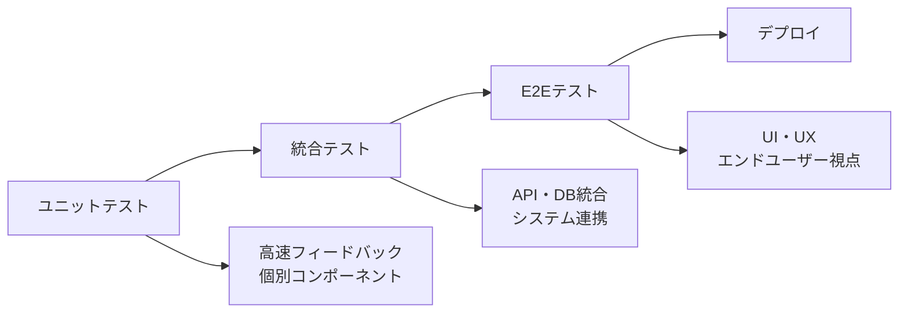

# 統合テスト（Integration Test）ガイド

## 概要

統合テストは、TodoApp-Nextにおいて複数のコンポーネントやサービスが連携して正常に動作することを検証するテストです。実際のAPI通信を通じてシステム全体の動作を確認し、ユニットテストでは検出できないコンポーネント間の相互作用に関する問題を発見します。

## 🎯 統合テストの目的と意義

### 検証対象

- **API エンドポイント**: REST API の完全なCRUD操作
- **認証フロー**: NextAuth.js + Firebase Admin SDK の統合
- **データベース操作**: Firestore での実際のデータ永続化
- **エラーハンドリング**: 異常系レスポンスの適切性
- **型安全性**: TypeScript型定義と実際のレスポンスの整合性

### 品質保証

- **本番環境再現**: Firebase Emulator による実環境に近い条件
- **システム間連携**: Next.js ↔ Firebase ↔ 認証システムの統合動作
- **リグレッション防止**: API変更時の既存機能への影響検証

## 🚀 統合テストの実行

**環境構築**: 詳細な環境設定は [DOCKER_TESTING.md](../DOCKER_TESTING.md) を参照してください。

### 基本実行

```bash
# 統合テストの実行（推奨）
npm run docker:test:run
```

## ⚙️ 統合テスト設定

### 専用設定ファイル

統合テストは専用の設定ファイルを使用します：

- **vitest.integration.config.ts**: 統合テスト専用のVitest設定
- **tests/setup-integration.ts**: 統合テスト用セットアップファイル
- **scripts/init-firebase-data.ts**: ユーザー分離テストデータ初期化（tsx実行）

### 設定の特徴

- **MSW無効化**: `NEXT_PUBLIC_API_MOCKING=disabled` で実API通信
- **Firebase Emulator接続**: 専用ポートでの分離環境
- **TypeScript実行**: tsx によるリアルタイムトランスパイル
- **ユーザー分離データ**: test-user-1 / test-admin-1 による役割別テスト

## 📊 テスト対象と範囲

### API統合テスト

#### Todo API（6テスト）

- **GET /api/(general)/todos**
  - 認証済みユーザーのTodoリスト取得
  - 未認証ユーザーの401エラー
- **POST /api/(general)/todos**
  - 新規Todo作成（201 Created）
  - 無効データの400エラー
- **PUT /api/(general)/todos**
  - 既存Todo更新（200 OK）
- **DELETE /api/(general)/todos**
  - 既存Todo削除（200 OK）

#### Lists API（1テスト）

- **GET /api/(general)/lists**
  - 認証済みユーザーのリスト取得

### 認証フロー統合

- **NextAuth.js + Firebase Admin SDK**: カスタム認証プロバイダーの統合
- **テスト認証**: `X-User-ID`ヘッダーによるテストユーザー認証
- **権限制御**: ユーザー固有データの適切な分離
- **ユーザー分離**: test-user-1（3 todos）/ test-admin-1（3 todos）の独立データ

### データベース統合

- **Firestore Emulator**: 実際のデータベース操作とsubcollection構造
- **データ初期化**: tsx実行による`scripts/init-firebase-data.ts`での自動初期化
- **ユーザー分離データ**: `export_test_data.ts`による本番同等のデータ構造
- **型安全性**: Firebase Timestamp型の適切な使用

## 🔧 テスト実装の技術詳細

### テストファイル構造

```typescript
// tests/features/todo/api.integration.test.ts
describe('Todo API Integration Tests', () => {
  beforeEach(async () => {
    // データクリアは時間がかかるためスキップし、既存データでテスト
    console.log('テストデータクリアをスキップ - 既存データでテスト実行');
  }, 5000);

  it('should get todos for authenticated user', async () => {
    // 認証済みユーザーでのTodo取得テスト
  });
});
```

### テストデータ管理

統合テストでは以下のデータ構造を使用：

```typescript
// export_test_data.ts からの抜粋
export const EXPORTED_TODOS_BY_USER: Record<string, TodoListProps[]> = {
  'test-user-1': [
    {
      id: 'todo-1',
      text: 'Next.js App Routerの学習',
      status: 'in-progress',
      bool: true,
      createdTime: Timestamp.fromDate(new Date('2024-01-01T00:00:00Z')),
      updateTime: Timestamp.fromDate(new Date('2024-01-01T00:00:00Z')),
    },
    // ... 3件のTodoデータ
  ],
  'test-admin-1': [
    // ... 管理者用の3件のTodoデータ
  ],
};
```

### API通信ログ例

```
GET /api/todos 200 in 5539ms    # 認証済みユーザーのTodo取得
GET /api/todos 401 in 64ms      # 未認証ユーザーの401エラー
POST /api/todos 201 in 96ms     # 新規Todo作成
POST /api/todos 400 in 66ms     # 無効データの400エラー
PUT /api/todos 200 in 166ms     # Todo更新
DELETE /api/todos 200 in 43ms   # Todo削除
GET /api/lists 200 in 1346ms    # リスト取得
```

## 🧪 テスト設計のベストプラクティス

### テスト独立性の確保

```typescript
describe('API Integration Tests', () => {
  // ❌ 悪い例：テスト間でデータが依存
  let createdTodoId: string;
  
  it('should create todo', async () => {
    const response = await createTodo(data);
    createdTodoId = response.id; // 他テストで使用
  });
  
  it('should update todo', async () => {
    await updateTodo(createdTodoId, data); // 前テストに依存
  });
  
  // ✅ 良い例：各テストが独立
  it('should create and update todo independently', async () => {
    const created = await createTodo(data);
    const updated = await updateTodo(created.id, updateData);
    expect(updated).toBeDefined();
  });
});
```

### エラーケースの網羅

```typescript
describe('Error Handling', () => {
  it('should return 401 for unauthenticated requests', async () => {
    const response = await fetch('/api/todos'); // 認証ヘッダーなし
    expect(response.status).toBe(401);
  });
  
  it('should return 400 for invalid data', async () => {
    const response = await createTodo({ text: '' }); // 無効なデータ
    expect(response.status).toBe(400);
  });
});
```

### 型安全性の検証

```typescript
it('should return correctly typed todo data', async () => {
  const response = await getTodos();
  const todos: TodoListProps[] = response.data;
  
  todos.forEach(todo => {
    expect(todo).toHaveProperty('id');
    expect(todo).toHaveProperty('text');
    expect(todo.createdTime).toBeInstanceOf(Timestamp);
  });
});
```

## 🐛 トラブルシューティングとデバッグ

### 統合テスト固有の問題

#### テストデータの状態確認

```bash
# Firebase Emulator UIでデータ確認
open http://localhost:4000

# tsx実行でデータ再初期化
tsx scripts/init-firebase-data.ts
```

#### 認証関連エラー

```typescript
// テスト用認証ヘッダーの確認
const headers = {
  'X-User-ID': 'test-user-1',
  'Content-Type': 'application/json'
};
```

#### タイムアウト対策

```typescript
// vitest.integration.config.ts
export default defineConfig({
  test: {
    testTimeout: 30000, // Firebase Emulator起動考慮
  }
});
```

### デバッグ手法

**詳細な環境確認は [DOCKER_TESTING.md](../DOCKER_TESTING.md) のトラブルシューティングセクションを参照してください。**

## 🎯 開発ワークフローにおける統合テストの位置づけ

### テスト戦略の全体像



### 品質保証プロセス

1. **開発中**: ユニットテスト（MSWモック環境）で高速フィードバック
2. **プルリクエスト**: 統合テスト（Firebase Emulator環境）でAPI検証
3. **リリース前**: E2Eテスト（実ブラウザ環境）でUX検証
4. **本番リリース**: 全テスト成功後の安全なデプロイ

### CI/CD統合

```yaml
# GitHub Actions での統合テスト実行例
- name: Run Integration Tests
  run: npm run docker:test:run
  timeout-minutes: 10
```

## 🔄 継続的改善

### テストカバレッジの監視

- **APIエンドポイント**: 全CRUD操作の網羅
- **エラーハンドリング**: 異常系レスポンスの検証
- **認証フロー**: 権限制御の適切性
- **データ整合性**: Firestore操作の正確性

### パフォーマンス監視

- **レスポンス時間**: API呼び出しの性能監視
- **テスト実行時間**: 13.03秒での安定実行維持
- **リソース使用量**: Docker環境での効率的実行

## 📋 関連ドキュメント

- **環境構築**: [DOCKER_TESTING.md](../DOCKER_TESTING.md) - Docker統合テスト環境の詳細
- **テスト戦略**: [TEST_ENVIRONMENTS.md](TEST_ENVIRONMENTS.md) - 全体的なテスト環境ガイドライン  
- **単体テスト**: [UT_TEST.md](UT_TEST.md) - ユニットテストガイド
- **E2Eテスト**: [E2E_TEST.md](E2E_TEST.md) - エンドツーエンドテストガイド

---

**💡 まとめ**: 統合テストは、ユニットテストとE2Eテストの橋渡しとして、APIレベルでのシステム品質を保証し、安全で確実なソフトウェア開発を支援します。
